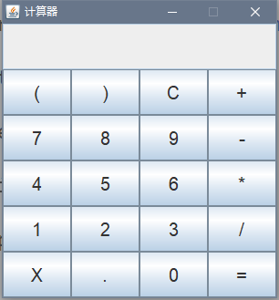

简易计算器
=
使用awt和swing帮老弟做一个简易的计算器。

## 功能
* 支持数字（包括小数）的四则运算。
* 支持输入校验，不允许用户进行错误的操作。比如一个数字中有多个小数点或者除数为0。

## 界面

界面包含一个显示框和一个按钮面板。显示框里显示用户的输入和计算结果。按钮面板按5行4列的布局有20个按钮。

按钮分为数字类、运算类、控制类。

数字类：0 1 2 3 4 4 5 6 7 8 9 小数点（.）

运算符类：加（+） 减（-） 乘（*） 除（/） 等于（=） 左括号（ 右括号）

控制类：回退（X） 清零（C）

## 坑
>* JFrame的setSize()设定的宽高是包括标题头在内的。因此实际可用的空间比设置的小。解决办法是直接设置ContentPane的preferredSize，然后JFrame使用pack()方法。
>* pack()方法是按照子组件的preferredSize来自适应大小，当布局管理器为null时，pack失效。
>* java8中提供的双冒号::语法可以很好地跟lambda表达式配合。
>* 使用递归计算表达式的结果，可能小学没学好，一开始没搞明白。